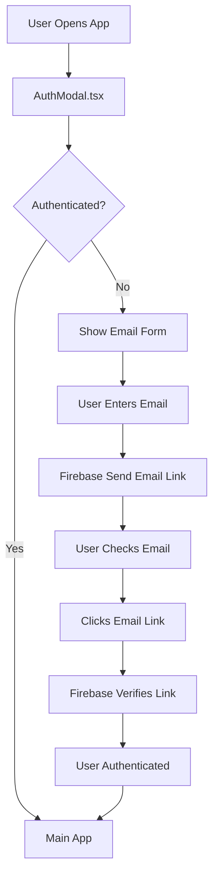
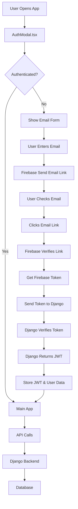

# LinkUp Authentication Flow

## 📋 Table of Contents
- [Current Authentication Flow (Firebase Email)](#current-authentication-flow-firebase-email)
- [Future Authentication Flow (Backend Integration)](#future-authentication-flow-backend-integration)
- [File Structure](#file-structure)
- [Implementation Details](#implementation-details)
- [Migration Guide](#migration-guide)

---

## 🔥 Current Authentication Flow (Firebase Email)

### Overview
The current system uses **Firebase Authentication** with **passwordless email links** for user authentication.

### Architecture Diagram



### Step-by-Step Flow

#### 1. **Initial Load**
```typescript
// app/page.tsx
const [isAuthenticated, setIsAuthenticated] = useState(false)
const [showAuthModal, setShowAuthModal] = useState(true)

// Check for existing authentication
useEffect(() => {
  const authToken = localStorage.getItem('auth_token')
  if (authToken) {
    setIsAuthenticated(true)
    setShowAuthModal(false)
  }
}, [])
```

#### 2. **Email Sign In/Up**
```typescript
// components/AuthModal.tsx
const handleSignInSubmit = async (e: React.FormEvent) => {
  const actionCodeSettings: ActionCodeSettings = {
    url: window.location.origin + '/?verified=true',
    handleCodeInApp: true,
  }
  
  await sendSignInLinkToEmail(auth, email, actionCodeSettings)
  window.localStorage.setItem('emailForSignIn', email)
  setStep('verification')
}
```

#### 3. **Email Verification**
```typescript
// AuthModal.tsx - useEffect
useEffect(() => {
  if (isSignInWithEmailLink(auth, window.location.href)) {
    let email = window.localStorage.getItem('emailForSignIn')
    signInWithEmailLink(auth, email, window.location.href)
      .then((result) => {
        window.localStorage.removeItem('emailForSignIn')
        onAuthenticated()
      })
  }
}, [])
```

#### 4. **Authentication Success**
```typescript
const handleAuthenticated = () => {
  setIsAuthenticated(true)
  setShowAuthModal(false)
  localStorage.setItem('auth_token', 'sample_token')
  localStorage.setItem('user_data', JSON.stringify({...}))
}
```

### Current File Structure
```
frontend/
├── components/
│   └── AuthModal.tsx          # Firebase email authentication
├── lib/
│   └── firebase.ts           # Firebase configuration
│   └── api.ts               # Commented out (Django backend)
├── app/
│   └── page.tsx             # Main app with auth state
└── .env.local               # Firebase config keys
```

### Technologies Used
- ✅ **Firebase Authentication**
- ✅ **Email Link (Passwordless)**
- ✅ **localStorage** for session persistence
- ✅ **Next.js** for frontend
- ✅ **TypeScript** for type safety

---

## 🚀 Future Authentication Flow (Backend Integration)

### Overview
The future system will integrate **Firebase Authentication** with your **Django backend** for comprehensive user management and data synchronization.

### Architecture Diagram



### Enhanced Flow Steps

#### 1. **Firebase Authentication** (Same as current)
```typescript
// Firebase email verification remains the same
await sendSignInLinkToEmail(auth, email, actionCodeSettings)
```

#### 2. **Firebase to Django Token Exchange**
```typescript
// After Firebase authentication success
const handleFirebaseAuth = async (firebaseUser) => {
  // Get Firebase ID token
  const firebaseToken = await firebaseUser.getIdToken()
  
  // Send to Django backend for verification
  const response = await apiService.exchangeFirebaseToken(firebaseToken)
  
  if (response.data) {
    // Store Django JWT token
    apiService.setToken(response.data.token)
    localStorage.setItem('user_data', JSON.stringify(response.data.user))
    onAuthenticated()
  }
}
```

#### 3. **Django Backend Verification**
```python
# Django backend endpoint (future implementation)
@api_view(['POST'])
def exchange_firebase_token(request):
    firebase_token = request.data.get('firebase_token')
    
    # Verify Firebase token
    decoded_token = auth.verify_id_token(firebase_token)
    email = decoded_token['email']
    
    # Get or create user in Django
    user, created = User.objects.get_or_create(
        email=email,
        defaults={'username': email}
    )
    
    # Generate Django JWT
    jwt_token = generate_jwt_token(user)
    
    return Response({
        'token': jwt_token,
        'user': UserSerializer(user).data
    })
```

#### 4. **API Service Integration**
```typescript
// lib/api.ts (when uncommented and enhanced)
class ApiService {
  async exchangeFirebaseToken(firebaseToken: string) {
    return this.request('/api/auth/firebase-exchange/', {
      method: 'POST',
      body: JSON.stringify({ firebase_token: firebaseToken }),
    })
  }
  
  // Profile, chat, and other API methods...
}
```

### Future File Structure
```
frontend/
├── components/
│   └── AuthModal.tsx          # Firebase + Django integration
├── lib/
│   └── firebase.ts           # Firebase configuration
│   └── api.ts               # Django backend API service
├── app/
│   └── page.tsx             # Main app with enhanced auth
└── .env.local               # Firebase + API config

backend/
├── apps/
│   └── authentication/
│       ├── views.py         # Firebase token exchange
│       ├── models.py        # User model
│       └── serializers.py   # User serialization
└── linkup/
    └── settings.py          # Firebase admin SDK config
```

---

## 📁 File Structure Details

### Current Implementation

#### `components/AuthModal.tsx`
- **Purpose:** Firebase email authentication UI
- **Features:** Email sign-in/up, verification page, resend functionality
- **Dependencies:** Firebase Auth SDK

#### `lib/firebase.ts`
- **Purpose:** Firebase configuration and initialization
- **Exports:** `auth` object for authentication

#### `lib/api.ts` (Currently Commented)
- **Purpose:** Django backend communication (future use)
- **Status:** Commented out, ready for future integration

### Future Implementation

#### Enhanced `components/AuthModal.tsx`
```typescript
// Will include both Firebase and Django integration
const handleAuthenticated = async (firebaseUser) => {
  const firebaseToken = await firebaseUser.getIdToken()
  const djangoResponse = await apiService.exchangeFirebaseToken(firebaseToken)
  
  if (djangoResponse.data) {
    setAuthenticationData(djangoResponse.data)
  }
}
```

#### Active `lib/api.ts`
```typescript
// Will be uncommented and enhanced
class ApiService {
  // Firebase token exchange
  async exchangeFirebaseToken(token: string) { ... }
  
  // User profile management
  async getProfile() { ... }
  async updateProfile(data: any) { ... }
  
  // Chat functionality
  async getChats() { ... }
  async sendMessage(chatId: string, message: string) { ... }
}
```

---

## 🔄 Migration Guide

### Phase 1: Current State ✅
- [x] Firebase email authentication
- [x] Basic UI/UX flows
- [x] Client-side state management

### Phase 2: Backend Integration (Future)
1. **Uncomment and enhance api.ts**
2. **Add Firebase Admin SDK to Django**
3. **Create Firebase token exchange endpoint**
4. **Integrate user profile synchronization**
5. **Add chat history persistence**

### Environment Variables Needed

#### Current (.env.local)
```env
# Firebase (Current)
NEXT_PUBLIC_FIREBASE_API_KEY=your_api_key
NEXT_PUBLIC_FIREBASE_AUTH_DOMAIN=your_domain
NEXT_PUBLIC_FIREBASE_PROJECT_ID=your_project_id
# ... other Firebase config
```

#### Future (.env.local)
```env
# Firebase (Keep current)
NEXT_PUBLIC_FIREBASE_API_KEY=your_api_key
# ... other Firebase config

# Django Backend (Add these)
NEXT_PUBLIC_API_URL=http://localhost:8000
NEXT_PUBLIC_WS_URL=ws://localhost:8000
```

---

## 🎯 Benefits of Each Approach

### Current (Firebase Only)
- ✅ **Quick Setup:** Minimal configuration required
- ✅ **Reliable:** Firebase handles email delivery
- ✅ **Scalable:** Firebase scales automatically
- ✅ **Secure:** Built-in security features

### Future (Firebase + Django)
- ✅ **Data Control:** Your data stays in your database
- ✅ **Custom Logic:** Implement complex business rules
- ✅ **Feature Rich:** User profiles, chat history, etc.
- ✅ **Integration:** Connect with other services/APIs

---

## 🛠️ Development Notes

### Current Development Workflow
1. **Setup Firebase project** (follow FIREBASE_SETUP.md)
2. **Configure environment variables**
3. **Test email authentication**
4. **Deploy and test production**

### Future Development Workflow
1. **Keep current Firebase setup**
2. **Setup Django Firebase Admin SDK**
3. **Uncomment and enhance api.ts**
4. **Create Django authentication endpoints**
5. **Test integration flow**
6. **Implement additional features**

---

*Last Updated: September 10, 2025*
*Current Status: Phase 1 (Firebase Only) - Complete ✅*
*Next Phase: Backend Integration - Planning 📋*
